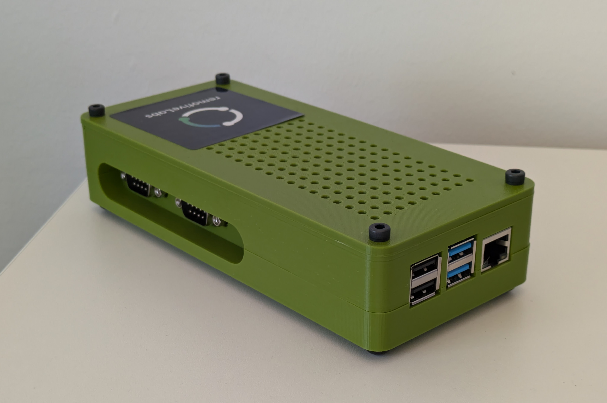
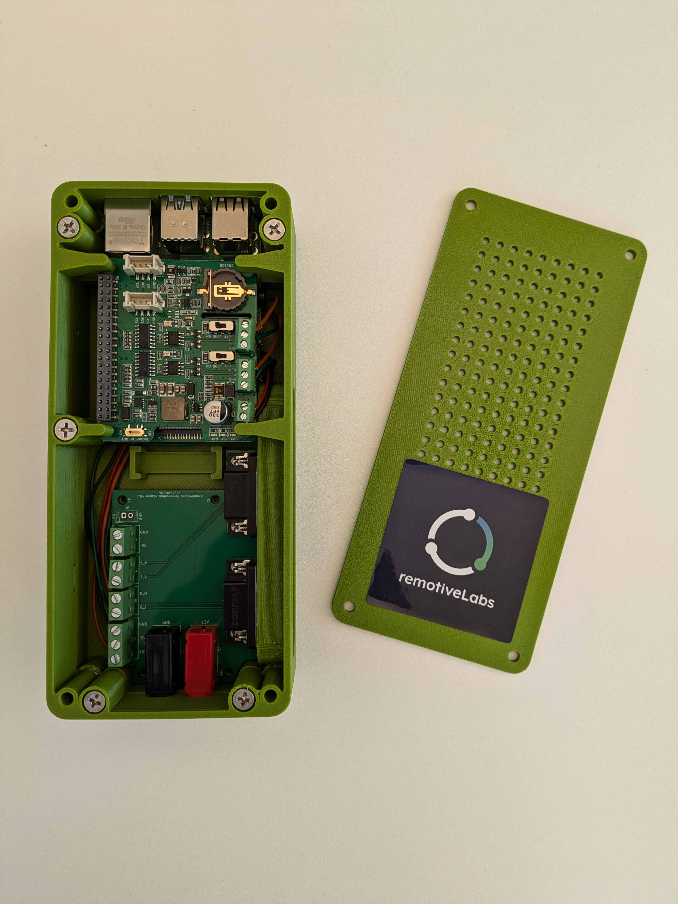

# RemotiveBox

[RemotiveBroker](https://remotivelabs.com) runs on the hardware of your choice. We have a growing list of [reference kits](https://remotivelabs.com/downloads-documentations/#section-referense-kit)
to ensure that getting started is quick and simple.

Here you can find STL files to print your own RemotiveBox.

Simply import the files from the folder [3D-model](3D-model) into your favorite 3D printer/slicing tool.

## Components

- Raspberry Pi 4 (4GB)
- [Seeed Studio](https://wiki.seeedstudio.com/2-Channel-CAN-BUS-FD-Shield-for-Raspberry-Pi/)

## Connectors

It's possible to purchase the necessary parts from [electrokit.com](https://www.electrokit.com/en/) or other electronics components store.

- D-SUB 9 pin, [41000551](https://www.electrokit.com/en/product/d-sub-9-conn-male/)
- Mounting kit (D-SUB mountings), [41011082](https://www.electrokit.com/en/product/mounting-kit-d-sub-13mm/)
- Banana jack (red), [41010873](https://www.electrokit.com/en/product/banana-jack-4mm-panel-mount-red/)
- Banana jack (black), [41010870](https://www.electrokit.com/en/product/banana-jack-4mm-panel-mount-black/)
- Rubber foot, [41001130](https://www.electrokit.com/en/product/rubber-foot-11x5-mm/)

## Gallery

